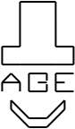

ABE
===
Block
=====
Exporter
========




Abe makes it easy to export disk over the NVMe protocol.

Abe listens for connection requests, and then exports requested block device
resources via a secured endpoint.  The client can then attach the drives via nvme cli.

Provided sample client exports a filesystem from that block dev.

This is a work in progress, more to come.

INSTALLING
==========

You can build the ABE server using docker with the following command:

```
docker run --rm --user "$(id -u)":"$(id -g)" -v "$PWD":/usr/src/myapp -w /usr/src/myapp rust sh -c 'cargo build --release'
```

